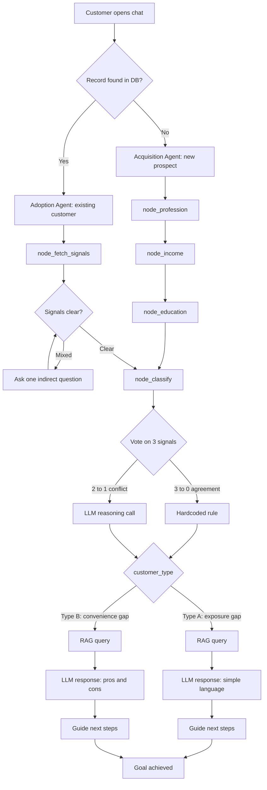

# ArthaSetu

**Agentic AI for Banking Customer Acquisition & Digital Adoption**

> 🚧 Work in progress — an ongoing personal project exploring agentic AI in banking.

---

## Problem Statement

Banks face increasing challenges in acquiring customers at scale, driving adoption of digital products, and creating meaningful long-term engagement. Branch managers in particular juggle two competing responsibilities at once: bringing in brand-new customers, and getting existing customers to adopt digital products they haven't tried yet.

ArthaSetu is an agentic AI system designed to assist with both — acquisition of new prospects, and adoption of digital products among existing customers — using a single underlying reasoning core.

## Core Insight

Low digital adoption isn't one problem — it's two different problems that look the same on the surface:

- **Exposure gap** — the customer hasn't had enough exposure to digital banking tools to feel comfortable using them (often, but not exclusively, more common in rural contexts with less digital infrastructure).
- **Convenience gap** — the customer is aware of digital products but hasn't been sufficiently nudged or motivated to adopt them (often, but not exclusively, more common in urban contexts).

Treating both groups the same way wastes effort. ArthaSetu's agent reasons about *which* gap a customer has before deciding *how* to engage them — adjusting tone, depth, and channel recommendations accordingly, rather than applying a one-size-fits-all script.

Importantly, this classification is based on **behavioral and contextual signals** (digital engagement patterns, education, occupation), never on geography or demographic labels directly — the system never tags anyone as "rural" or "urban."

## Architecture Overview

ArthaSetu has two entry points that converge into a shared pipeline:



Both entry points only differ in **how** the state gets filled — asking conversationally vs. fetching from existing records. Everything from `node_classify` onward is identical logic shared by both paths.

- **Acquisition Agent** — for brand-new prospects with no existing bank relationship. Builds a profile conversationally (profession, income, education) since no account data exists yet.
- **Adoption Agent** — for existing customers. Fetches behavioral signals silently from existing data (login frequency, digital vs. branch transaction ratio, KYC-linked education/occupation).

Both paths feed into the same **classification core**:

1. Each available signal is scored as leaning toward **Type A (exposure gap)** or **Type B (convenience gap)**.
2. If the signals agree (e.g. 3-0), a fast hardcoded rule decides instantly.
3. If the signals conflict (e.g. 2-1), an LLM call reasons over the context to make the call — handling edge cases a fixed rule would get wrong (e.g. a farmer with high income and strong education shouldn't be auto-classified as exposure-gap).

From there, both customer types go through the same RAG-grounded response pipeline — facts retrieved are identical for everyone; only the LLM's phrasing, tone, and emphasis differ based on customer type.

## Tech Stack (so far)

- **LLM:** Llama3 via Ollama (local)
- **Embeddings:** nomic-embed-text via Ollama (local)
- **Vector store:** ChromaDB (persistent, local)
- **Agent orchestration:** LangGraph (state-based graph, in progress)
- **Classification logic:** Hybrid rule-based scoring + LLM fallback, with prompt-forced structured output (`FINAL ANSWER: A/B`) for reliable parsing
- **Language:** Python 3.12

## Current Progress

- [x] Problem framing and architecture design
- [x] RAG knowledge base — product documents (`data/products/`) for Fixed Deposit, Recurring Deposit, Savings Account, Life Insurance
- [x] Section-wise chunking strategy (chunks split by `##` heading: overview, eligibility, rates, risks, how_to_apply)
- [x] Ingestion pipeline (`agents/ingest.py`) — embeds and stores chunks in ChromaDB with `product_name` and `section_type` metadata
- [x] Retrieval test script (`agents/test_retrieval.py`) — verified correct retrieval across products and sections
- [x] LangGraph fundamentals validated with a minimal test graph (`agents/hello_langgraph.py`)
- [x] Acquisition agent conversational flow — first 3 nodes (`node_profession`, `node_income`, `node_education`) implemented and tested (`agents/acquisition_agent_v1.py`)
- [x] Hybrid rule + LLM classification logic (`agents/classify_logic.py`) — signal scoring (income, education, profession), vote tallying (3-0 clear vs 2-1 conflict), LLM fallback for unrecognized professions, and LLM-based conflict resolution for genuine disagreements. Tested against multiple real scenarios including the original high-income, educated farmer edge case.
- [ ] More product documents (loans)
- [ ] Wire `node_classify` into the actual LangGraph graph (logic is built and tested standalone; not yet connected to a live Ollama LLM instance or the graph)
- [ ] Adoption agent signal-fetching logic
- [ ] Full graph wiring (acquisition + adoption paths converging into classification + RAG response)
- [ ] End-to-end demo

## Known Limitations

- **Freshers / no established profession:** The current classification signals (profession, income, education) assume the customer has an established job and income. Students, recent graduates, or unemployed customers don't fit this cleanly — for example, a fresh engineering graduate with high education but little or no income doesn't map well onto the existing rules. A planned improvement is to detect this group during conversation and use a different signal set for them (e.g. field of study, or intended use of the account, instead of income).
- **Profession coverage is necessarily incomplete:** The hardcoded profession lookup table only covers common professions. Anything not listed falls back to an LLM call to make the judgment — this keeps the system accurate for unusual professions, at the cost of an extra LLM call for those cases specifically.
- **LLM response parsing:** Early versions of the LLM-based classification asked for a bare "A or B" answer and matched it exactly — this broke whenever the model added any extra words, punctuation, or reasoning before its answer, and silently defaulted to a fixed letter on failure (which could flip a correct answer to its opposite). The current version forces the LLM to end its response with an explicit `FINAL ANSWER: A` or `FINAL ANSWER: B` marker, which is parsed directly — this was specifically tested against responses that reason about each signal individually before concluding (e.g. "income and profession suggest B, but education suggests A — FINAL ANSWER: B") to confirm the right answer is extracted even when multiple letters appear earlier in the reasoning.

## Project Structure

```
ArthaSetu/
├── agents/              # Agent logic, graph nodes, ingestion & test scripts
├── data/
│   ├── products/        # RAG knowledge base - one .md file per banking product
│   └── chroma_db/       # Persistent ChromaDB store (generated, not committed)
├── notebooks/           # Exploration and experiments
├── requirements.txt
└── README.md
```

## Setup

```bash
# Clone and enter the project
git clone https://github.com/Soumya-205/ArthaSetu.git
cd ArthaSetu

# Create and activate a virtual environment (Python 3.12 recommended)
python -m venv venv
venv\Scripts\activate          # Windows
# source venv/bin/activate     # macOS/Linux

# Install dependencies
pip install -r requirements.txt

# Pull required Ollama models
ollama pull llama3
ollama pull nomic-embed-text

# Build the knowledge base
python agents/ingest.py

# Try retrieval
python agents/test_retrieval.py
```

## Note on Data

Product details (interest rates, eligibility criteria) used in this project are **illustrative and synthetic**, modeled on real banking product categories but not scraped from any live source. They are not accurate, current rates for any real bank and should not be used for actual financial decisions.

## Author

Built by [Soumya](https://github.com/Soumya-205) — BTech CSE (Data Science), Manipal University Jaipur.