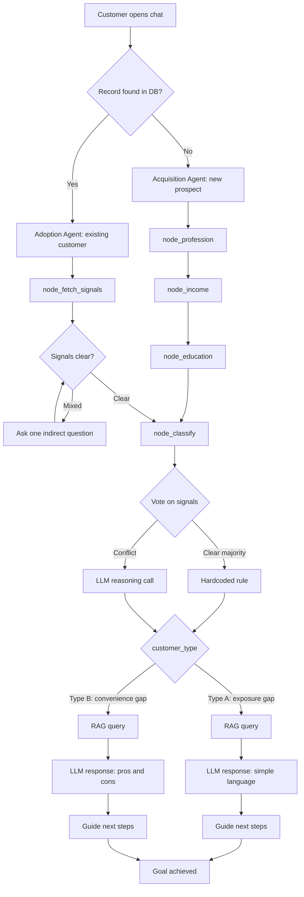
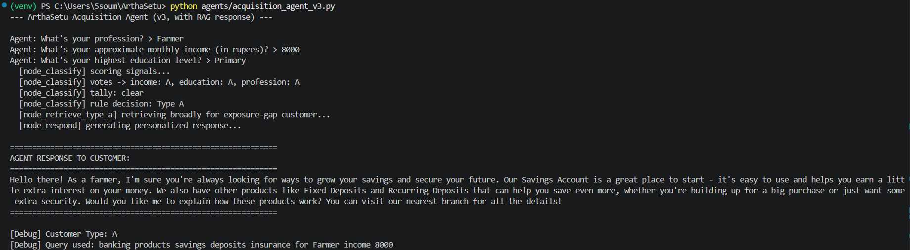
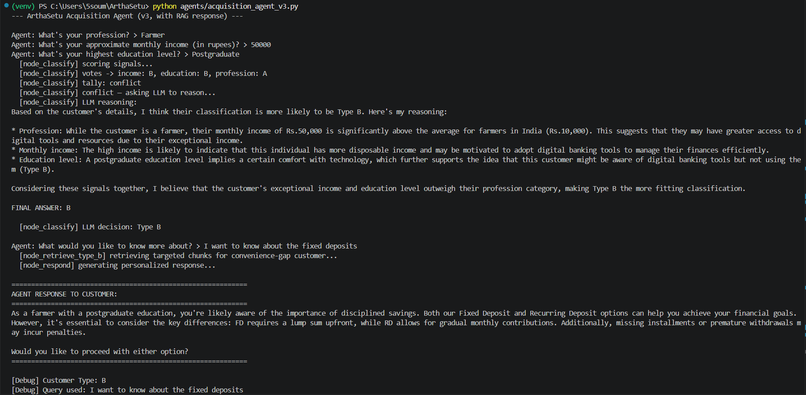
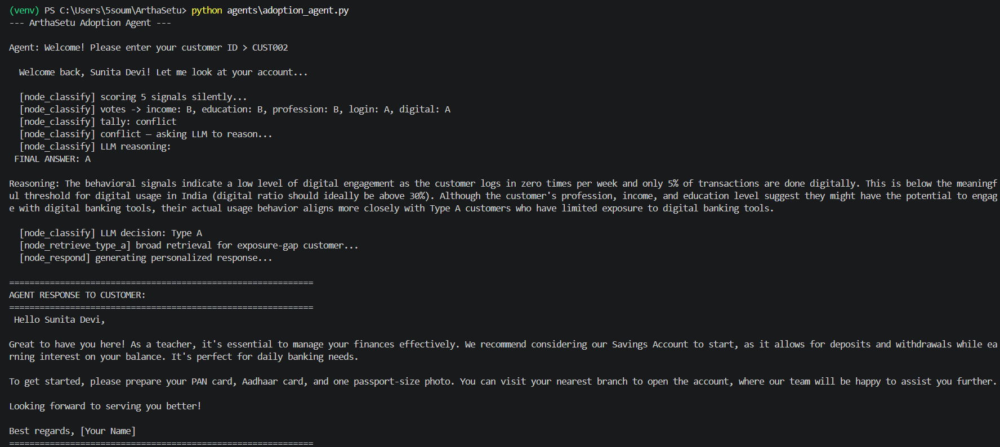
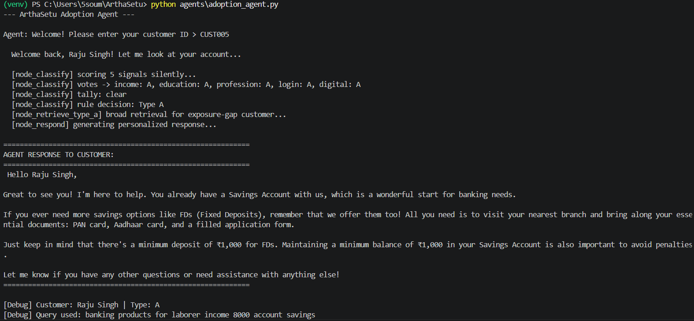
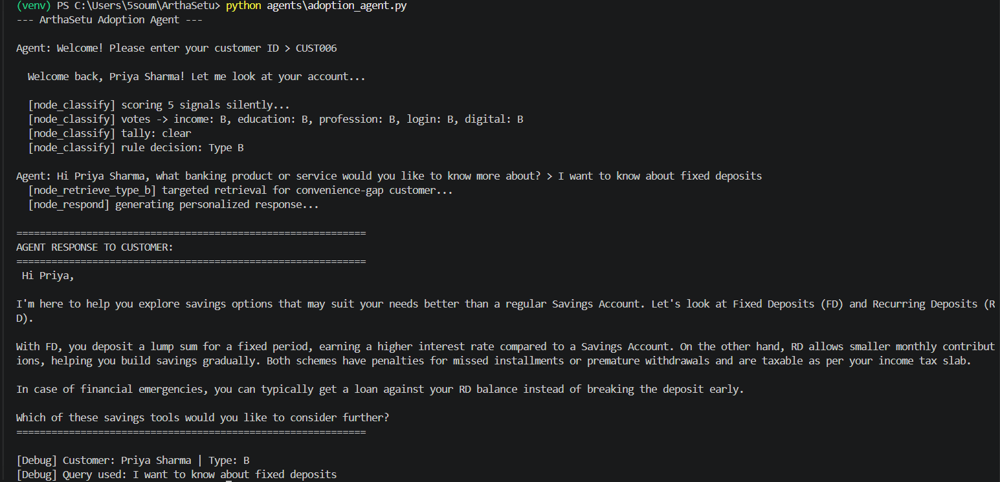

# ArthaSetu

**Agentic AI for Banking Customer Acquisition & Digital Adoption**

> 🚧 Work in progress — an ongoing personal project exploring agentic AI in banking.

---

## Problem Statement

Banks face increasing challenges in acquiring customers at scale, driving adoption of digital products, and creating meaningful long-term engagement. Branch managers in particular juggle two competing responsibilities at once: bringing in brand-new customers, and getting existing customers to adopt digital products they haven't tried yet.

ArthaSetu is an agentic AI system designed to assist with both — acquisition of new prospects, and adoption of digital products among existing customers — using a single underlying reasoning core.

## Core Insight

Low digital adoption isn't one problem — it's two different problems that look the same on the surface:

- **Exposure gap** — the customer hasn't had enough exposure to digital banking tools to feel comfortable using them (often, but not exclusively, more common in rural contexts with less digital infrastructure).
- **Convenience gap** — the customer is aware of digital products but hasn't been sufficiently nudged or motivated to adopt them (often, but not exclusively, more common in urban contexts).

Treating both groups the same way wastes effort. ArthaSetu's agent reasons about *which* gap a customer has before deciding *how* to engage them — adjusting tone, depth, and channel recommendations accordingly, rather than applying a one-size-fits-all script.

Importantly, this classification is based on **behavioral and contextual signals** (digital engagement patterns, education, occupation), never on geography or demographic labels directly — the system never tags anyone as "rural" or "urban."

## Architecture Overview

ArthaSetu has two entry points that converge into a shared pipeline:


```mermaid
flowchart TD
    A[Customer opens chat] --> B{Record found in DB?}
    B -->|No| C[Acquisition Agent: new prospect]
    B -->|Yes| D[Adoption Agent: existing customer]

    C --> C1[node_profession]
    C1 --> C2[node_income]
    C2 --> C3[node_education]

    D --> D1[node_fetch_signals]
    D1 --> D2{Signals clear?}
    D2 -->|Mixed| D3[Ask one indirect question]
    D3 --> D2

    C3 --> E[node_classify]
    D2 -->|Clear| E

    E --> E1{Vote on signals}
    E1 -->|Clear majority| E2[Hardcoded rule]
    E1 -->|Conflict| E3[LLM reasoning call]

    E2 --> F{customer_type}
    E3 --> F

    F -->|Type A: exposure gap| G1[RAG query]
    F -->|Type B: convenience gap| G2[RAG query]

    G1 --> H1[LLM response: simple language]
    G2 --> H2[LLM response: pros and cons]

    H1 --> I1[Guide next steps]
    H2 --> I2[Guide next steps]

    I1 --> J[Goal achieved]
    I2 --> J
```

- **Acquisition Agent** — for brand-new prospects with no existing bank relationship. Builds a profile conversationally (profession, income, education) since no account data exists yet. Uses a 3-signal voting system (3-0 clear → rule, 2-1 conflict → LLM).
- **Adoption Agent** — for existing customers. Fetches behavioral signals silently from SQLite (login frequency, digital transaction ratio, KYC-linked education/occupation). Uses a stricter 5-signal voting system (4-of-5 clear → rule, 3-2 or worse → LLM).

Both paths feed into the same **classification core**, and the conflict-resolution LLM prompt for the Adoption Agent explicitly includes behavioral signals — giving actual usage patterns priority over profile signals alone.

## Acquisition Agent Demo

Two runs showing the conditional routing in action — same profession (farmer), different income and education, completely different paths and responses.

**Type A — Exposure gap (farmer, ₹8,000/month, primary education)**

Signals agree 3-0 → instant rule decision, no LLM call → broad retrieval → simple, benefits-first response with branch fallback.



**Type B — Convenience gap (farmer, ₹50,000/month, postgraduate)**

Signals conflict 2-1 → LLM reasons over context, correctly identifies exceptional income → routes to Type B → asks customer what they want to know → targeted retrieval → comparative, analytical response.



## Adoption Agent Demo

Three runs showing the Adoption Agent silently fetching customer data from SQLite and routing accordingly — no conversational signal collection, everything comes from the database.

**Run 1 — Clear Type A (Raju Singh, laborer, ₹8,000/month)**

5-0 unanimous vote → instant rule decision, no LLM call → simple response with branch mention.



**Run 2 — Conflict resolved to Type A (Sunita Devi, teacher, ₹45,000/month)**

3-2 split → LLM reasons with behavioral signals (0 logins/week, 5% digital ratio) → correctly classifies as Type A despite high income and education, because actual usage behavior is the stronger signal.



**Run 3 — Clear Type B (Priya Sharma, software engineer, ₹85,000/month)**

5-0 unanimous vote → agent asks what she wants to know → targeted retrieval → comparative, analytical response.



The node names firing in sequence in the terminal (`⟶ Node fired: [node_name]`) show the agent making real routing decisions at runtime — not following a fixed script.

## Tech Stack

- **LLM:** Llama3 (primary) / Mistral (drop-in alternative) via Ollama (local, no external API dependency)
- **Embeddings:** nomic-embed-text via Ollama (local)
- **Vector store:** ChromaDB (persistent, local) for RAG knowledge base
- **Customer database:** SQLite with synthetic customer profiles
- **Agent orchestration:** LangGraph (state-based graph with conditional edges and real-time streaming)
- **Classification logic:** Hybrid rule-based scoring + LLM fallback, with prompt-forced structured output (`FINAL ANSWER: A/B`) for reliable parsing
- **Language:** Python 3.12

## Current Progress

- [x] Problem framing and architecture design
- [x] RAG knowledge base — product documents (`data/products/`) for Fixed Deposit, Recurring Deposit, Savings Account, Life Insurance, Personal Loan (5 products, 25 chunks total)
- [x] Section-wise chunking strategy (chunks split by `##` heading: overview, eligibility, rates, risks, how_to_apply)
- [x] Ingestion pipeline (`agents/ingest.py`) — embeds and stores chunks in ChromaDB with `product_name` and `section_type` metadata
- [x] Retrieval test script (`agents/test_retrieval.py`) — verified correct retrieval across products and sections
- [x] LangGraph fundamentals validated with a minimal test graph (`agents/hello_langgraph.py`)
- [x] Acquisition Agent — full end-to-end graph with conversational signal collection, hybrid classification, conditional routing, RAG retrieval, and personalized response (`agents/acquisition_agent_v3.py`)
- [x] Hybrid rule + LLM classification logic (`agents/classify_logic.py`) — 3-signal and 5-signal voting, LLM fallback for unknown professions, conflict resolution with `FINAL ANSWER` structured output
- [x] Adoption Agent — full end-to-end graph fetching signals silently from SQLite, 5-signal classification with behavioral signals, conditional routing, RAG retrieval, personalized response (`agents/adoption_agent.py`)
- [x] Synthetic customer database (`data/customers.db`) — 7 profiles covering clear Type A, clear Type B, and ambiguous conflict cases
- [x] Terminal streaming — both agents stream node execution in real time using `stream_mode="updates"`, showing the agent's routing decisions as they happen
- [ ] Final README and repo cleanup

## Known Limitations

- **Freshers / no established profession:** The current classification signals (profession, income, education) assume the customer has an established job and income. Students, recent graduates, or unemployed customers don't fit this cleanly — a planned improvement is to detect this group during conversation and use a different signal set (e.g. field of study instead of income).
- **Profession coverage is necessarily incomplete:** The hardcoded profession lookup table only covers common professions. Anything not listed falls back to an LLM call — this keeps the system accurate for unusual professions, at the cost of an extra LLM call for those cases.
- **LLM response parsing:** Early versions asked for a bare "A or B" answer and matched it exactly — this broke whenever the model added extra words or reasoning, and silently defaulted to a fixed letter. The current version forces the LLM to end with an explicit `FINAL ANSWER: A` or `FINAL ANSWER: B` marker, tested against multi-signal reasoning responses to confirm the right answer is always extracted.
- **Behavioral signals not yet passed to Acquisition Agent conflict resolution:** The Acquisition Agent's conflict resolver only sees profession, income, and education — it has no behavioral data since the customer is new. The Adoption Agent's resolver correctly includes login frequency and digital transaction ratio.

## Project Structure

```
ArthaSetu/
├── agents/
│   ├── ingest.py                  # RAG ingestion pipeline
│   ├── test_retrieval.py          # RAG retrieval verification
│   ├── classify_logic.py          # Hybrid classification scoring + LLM functions
│   ├── setup_db.py                # SQLite synthetic customer database setup
│   ├── hello_langgraph.py         # Minimal LangGraph test
│   ├── acquisition_agent_v1.py    # Acquisition: 3-node conversational chain
│   ├── acquisition_agent_v2.py    # Acquisition: + classification node
│   ├── acquisition_agent_v3.py    # Acquisition: full graph with RAG response
│   └── adoption_agent.py          # Adoption: full graph with SQLite + RAG response
├── data/
│   ├── products/                  # RAG knowledge base — one .md file per product
│   ├── chroma_db/                 # Persistent ChromaDB store (generated, not committed)
│   └── customers.db               # Synthetic SQLite customer database
├── docs/                          # Demo screenshots
├── notebooks/                     # Exploration and experiments
├── requirements.txt
└── README.md
```

## Setup

```bash
# Clone and enter the project
git clone https://github.com/Soumya-205/ArthaSetu.git
cd ArthaSetu

# Create and activate a virtual environment (Python 3.12 recommended)
python -m venv venv
venv\Scripts\activate          # Windows
# source venv/bin/activate     # macOS/Linux

# Install dependencies
pip install -r requirements.txt

# Pull required Ollama models (must have Ollama installed and running)
ollama pull llama3
ollama pull nomic-embed-text

# Note: if you have a GPU with limited VRAM (under 5GB), Llama3 may crash.
# Mistral is a drop-in alternative already supported in the codebase:
ollama pull mistral
# Then change ChatOllama(model="llama3") to ChatOllama(model="mistral") in both agent files.

# If CUDA errors occur, force CPU-only mode before starting Ollama (Windows PowerShell):
# $env:CUDA_VISIBLE_DEVICES="-1"; ollama serve

# Build the RAG knowledge base
python agents/ingest.py

# Set up the synthetic customer database
python agents/setup_db.py

# Run the Acquisition Agent
python agents/acquisition_agent_v3.py

# Run the Adoption Agent
python agents/adoption_agent.py
```

## Note on Data

Product details (interest rates, eligibility criteria) used in this project are **illustrative and synthetic**, modeled on real banking product categories but not scraped from any live source. They are not accurate current rates for any real bank and should not be used for actual financial decisions. Customer profiles in the SQLite database are entirely fictional.

## Author

Built by [Soumya](https://github.com/Soumya-205) — BTech CSE (Data Science), Manipal University Jaipur.