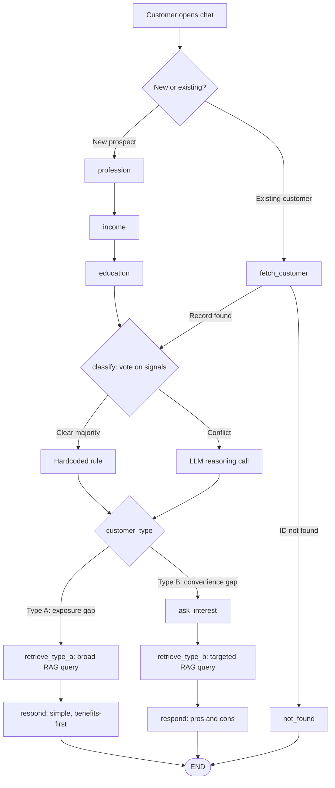
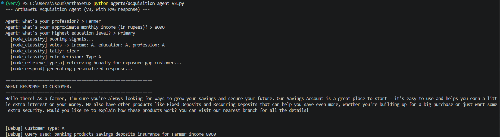
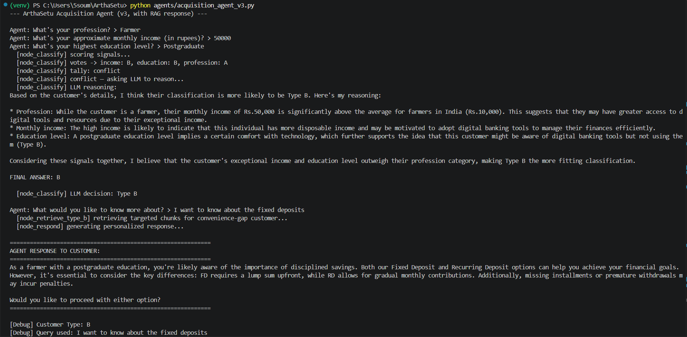
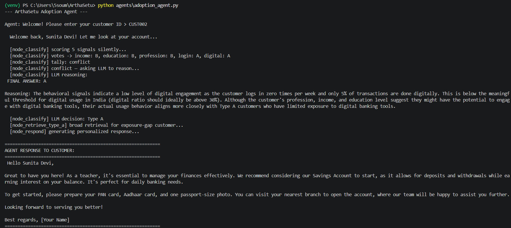
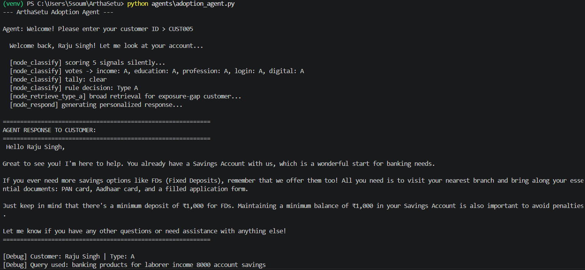
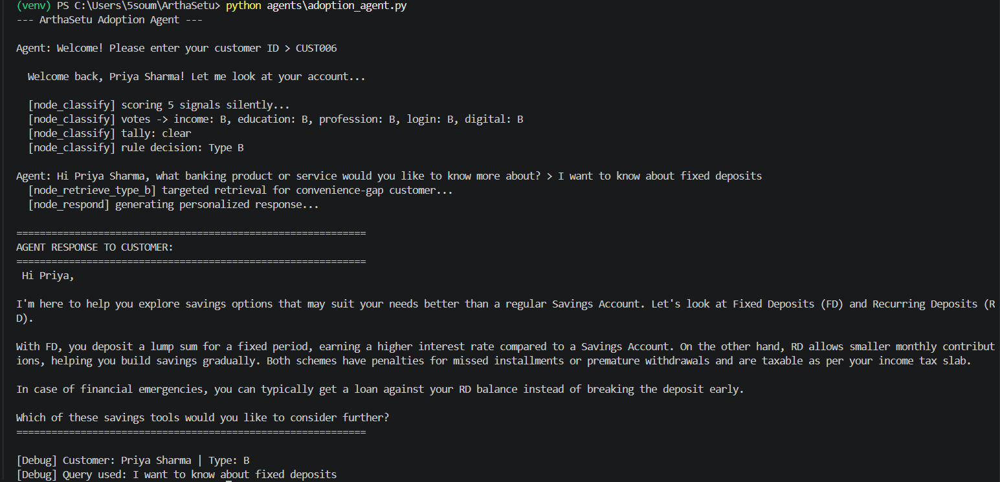
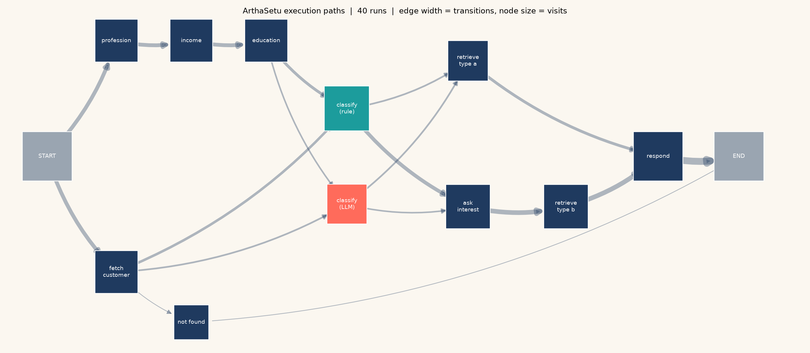
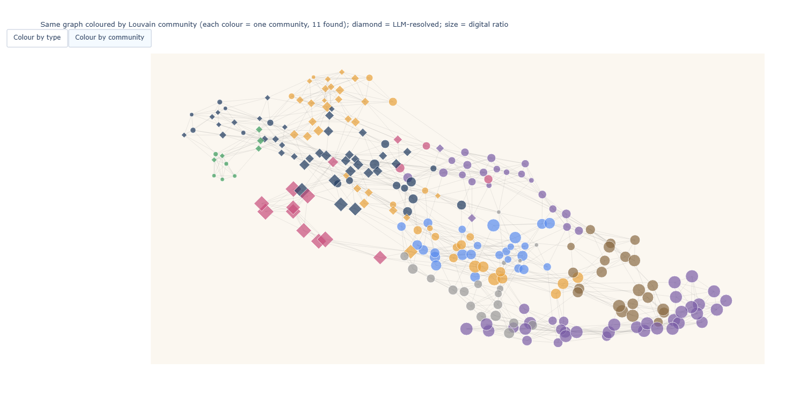
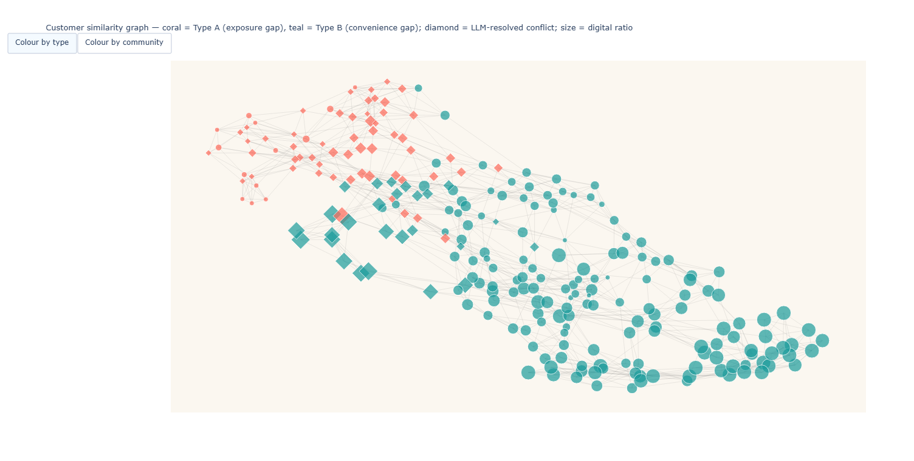

# ArthaSetu

**Agentic AI for Banking Customer Acquisition & Digital Adoption**

---

## Problem Statement

Banks face increasing challenges in acquiring customers at scale, driving adoption of digital products, and creating meaningful long-term engagement. Branch managers in particular juggle two competing responsibilities at once: bringing in brand-new customers, and getting existing customers to adopt digital products they haven't tried yet.

ArthaSetu is an agentic AI system designed to assist with both — acquisition of new prospects, and adoption of digital products among existing customers — using a single underlying reasoning core.

## Core Insight

Low digital adoption isn't one problem — it's two different problems that look the same on the surface:

- **Exposure gap** — the customer hasn't had enough exposure to digital banking tools to feel comfortable using them (often, but not exclusively, more common in rural contexts with less digital infrastructure).
- **Convenience gap** — the customer is aware of digital products but hasn't been sufficiently nudged or motivated to adopt them (often, but not exclusively, more common in urban contexts).

Treating both groups the same way wastes effort. ArthaSetu's agent reasons about *which* gap a customer has before deciding *how* to engage them — adjusting tone, depth, and channel recommendations accordingly, rather than applying a one-size-fits-all script.

Importantly, this classification is based on **behavioral and contextual signals** (digital engagement patterns, education, occupation), never on geography or demographic labels directly — the system never tags anyone as "rural" or "urban."

## Architecture Overview

ArthaSetu has two entry points that converge into a shared pipeline:


```mermaid
flowchart TD
    A[Customer opens chat] --> B{New or existing?}

    B -->|New prospect| P[profession]
    P --> I[income]
    I --> E[education]
    E --> C

    B -->|Existing customer| F[fetch_customer]
    F -->|ID not found| NF[not_found]
    F -->|Record found| C

    C{classify: vote on signals}
    C -->|Clear majority| R[Hardcoded rule]
    C -->|Conflict| L[LLM reasoning call]

    R --> T{customer_type}
    L --> T

    T -->|Type A: exposure gap| RA[retrieve_type_a: broad RAG query]
    T -->|Type B: convenience gap| AI[ask_interest]
    AI --> RB[retrieve_type_b: targeted RAG query]

    RA --> RS[respond: simple, benefits-first]
    RB --> RS2[respond: pros and cons]

    RS --> END([END])
    RS2 --> END
    NF --> END
```

- **Acquisition Agent** — for brand-new prospects with no existing bank relationship. Builds a profile conversationally (profession, income, education) since no account data exists yet. Uses a 3-signal voting system (3-0 clear → rule, 2-1 conflict → LLM).
- **Adoption Agent** — for existing customers. Fetches behavioral signals silently from SQLite (login frequency, digital transaction ratio, KYC-linked education/occupation). Uses a stricter 5-signal voting system (4-of-5 clear → rule, 3-2 or worse → LLM).

Both paths feed into the same **classification core**, and the conflict-resolution LLM prompt for the Adoption Agent explicitly includes behavioral signals — giving actual usage patterns priority over profile signals alone.

## Acquisition Agent Demo

Two runs showing the conditional routing in action — same profession (farmer), different income and education, completely different paths and responses.

**Type A — Exposure gap (farmer, ₹8,000/month, primary education)**

Signals agree 3-0 → instant rule decision, no LLM call → broad retrieval → simple, benefits-first response with branch fallback.



**Type B — Convenience gap (farmer, ₹50,000/month, postgraduate)**

Signals conflict 2-1 → LLM reasons over context, correctly identifies exceptional income → routes to Type B → asks customer what they want to know → targeted retrieval → comparative, analytical response.



## Adoption Agent Demo

Three runs showing the Adoption Agent silently fetching customer data from SQLite and routing accordingly — no conversational signal collection, everything comes from the database.

**Run 1 — Clear Type A (Raju Singh, laborer, ₹8,000/month)**

5-0 unanimous vote → instant rule decision, no LLM call → simple response with branch mention.



**Run 2 — Conflict resolved to Type A (Sunita Devi, teacher, ₹45,000/month)**

3-2 split → LLM reasons with behavioral signals (0 logins/week, 5% digital ratio) → correctly classifies as Type A despite high income and education, because actual usage behavior is the stronger signal.



**Run 3 — Clear Type B (Priya Sharma, software engineer, ₹85,000/month)**

5-0 unanimous vote → agent asks what she wants to know → targeted retrieval → comparative, analytical response.



The node names firing in sequence in the terminal (`⟶ Node fired: [node_name]`) show the agent making real routing decisions at runtime — not following a fixed script.

## Graph Visualization

This section adds a graph-visualization layer to ArthaSetu. Two graphs answer two different questions about the system:

1. **Execution-path graph** — *how does the agent actually behave?* Built from logged runs of the two LangGraph agents.
2. **Customer similarity graph** — *how do customers group, and where is classification hard?* Built from customer signals, labelled by ArthaSetu's own classifier.

### 1. Execution-path graph (agent behavior)



**Data.** Both agents log every node that fires (`agents/trace_logger.py`, using the same `stream_mode="updates"` loop that prints `⟶ Node fired`) to `viz/traces.jsonl`. `viz/run_batch.py` drove 40 non-interactive runs (20 through the Acquisition Agent, 20 through the Adoption Agent) with scripted inputs, including one invalid customer ID to exercise the `not_found` path.

**Graph model.** A weighted, directed graph. Nodes are LangGraph nodes (plus `START`/`END`); an edge `u → v` means `v` fired right after `u` in a run; edge weight is the number of runs that took that transition. The `classify` node is split into `classify (rule)` and `classify (LLM)` using the `classification_route` value each agent now returns.

**Layout.** A fixed, hand-placed layered layout rather than a force-directed one. The topology is small (13 nodes) and known in advance, so a fixed layout keeps the left-to-right flow readable and stable between runs: Acquisition on the top lane, Adoption on the bottom lane, shared nodes in the middle, with the Type A and Type B branches separated vertically.

**Visual encodings.**

| Channel | Encodes |
|---|---|
| Node size | Number of visits |
| Edge width | Number of transitions |
| Node colour (at `classify`) | Teal = resolved by rule, coral = resolved by LLM |
| Position | Pipeline stage (x) and agent lane (y) |

**What it shows.**
- 13 of 39 classifications (33%) needed the LLM conflict resolver; the other 67% were settled by the cheap rule-based vote. The hybrid design keeps most decisions LLM-free.
- 25 of 39 customers (64%) were routed down the Type B path (`ask_interest → retrieve_type_b`), 14 down the Type A path.
- Every run converges on `respond`, and `not_found` is a rare, isolated branch.

### 2. Customer similarity graph (classification structure)



**Data.** 250 *synthetic* customers generated by `viz/gen_customers.py` (profession, education, income, weekly logins, digital transaction ratio), each labelled Type A or Type B by ArthaSetu's real `classify_logic.py` 5-signal vote (`tally_votes_adoption`). The database only holds 7 customers, which is too few for a meaningful graph, hence the synthetic set.

**Graph model.** An undirected, weighted k-nearest-neighbour graph (k = 6). Signals are standardised, each customer is linked to its 6 most similar customers, and edge weight is `1 / (1 + distance)`. Communities are found with the Louvain algorithm.

**Layout.** Force-directed (Fruchterman–Reingold spring layout, weighted by similarity), so similar customers end up close together and structure emerges without being imposed.

**Visual encodings.**

| Channel | Encodes |
|---|---|
| Node colour | Type A (coral, exposure gap) vs Type B (teal, convenience gap) — or Louvain community (toggle) |
| Node shape | Circle = decided by the rule vote, diamond = conflict case resolved by the LLM path |
| Node size | Digital transaction ratio |
| Edges | Thin, low-opacity lines to limit clutter |

**Interaction.** Hover for customer details (profession, income, signals, type, route, community, boundary score), zoom and pan, and a button to switch colouring between customer type and community.



**What it shows.**

| Metric | Value |
|---|---|
| Customers | 250 (181 Type B, 69 Type A) |
| Decided by rule / by conflict path | 168 / 82 |
| Louvain communities | 11 |
| Modularity | 0.700 |
| Type purity of communities | 91.2% |
| Boundary score, rule-decided customers | 0.037 |
| Boundary score, LLM-path customers | 0.188 |

*Boundary score = the share of a customer's 6 nearest neighbours that have the opposite type.* Communities line up strongly with customer type (91.2% purity, modularity 0.70), and the customers that needed the LLM sit about five times closer to the Type A / Type B border than rule-decided ones. In other words, the cases where the rules disagree are exactly the ones that lie between the two groups, which is what the hybrid rule + LLM design is meant to handle.

### Limitations of the visualization

- The 250 customers are **synthetic**, generated from signal distributions I chose. They illustrate the method; they are not real bank data.
- The graph is built from the same signals the classifier votes on, so some of the type/community separation is by construction. The boundary-score result is the more informative finding.
- In the similarity graph, the 82 conflict cases are labelled with the real vote, but the final Type A/B call for those is approximated with a behavioral-priority rule rather than a live LLM call for each (`gen_customers.py --real-llm` uses the real model instead).
- The execution traces come from **scripted** runs with canned inputs, not real user conversations, and the Adoption runs reuse the 7 database customers. For speed, the final customer-facing LLM response was stubbed in `--fast` mode; classification (including the LLM conflict resolver) ran for real.

### Reproducing the visualizations

```bash
pip install networkx scikit-learn plotly matplotlib pandas

# 1. Execution-path graph (writes viz/traces.jsonl, then draws the graph)
python viz/run_batch.py --fast --cpu -n 40
python viz/exec_graph.py -o viz/exec_graph.png

# 2. Customer similarity graph (open the HTML file in a browser)
python viz/gen_customers.py --real -o viz/customers_synth.csv
python viz/similarity_graph.py --csv viz/customers_synth.csv -o viz/similarity_graph.html
```

`--cpu` runs the LLM on the CPU, which avoids CUDA crashes on GPUs with limited VRAM. Running either agent directly (`python agents/adoption_agent.py`) also appends its node trace to `viz/traces.jsonl`.

## Tech Stack

- **LLM:** Mistral via Ollama (local, no external API dependency); Llama3 also works by changing the model name in the agent files
- **Embeddings:** nomic-embed-text via Ollama (local)
- **Vector store:** ChromaDB (persistent, local) for RAG knowledge base
- **Customer database:** SQLite with synthetic customer profiles
- **Agent orchestration:** LangGraph (state-based graph with conditional edges and real-time streaming)
- **Classification logic:** Hybrid rule-based scoring + LLM fallback, with prompt-forced structured output (`FINAL ANSWER: A/B`) for reliable parsing
- **Graph visualization:** NetworkX (graph construction, Louvain communities), scikit-learn (k-nearest neighbours), Plotly (interactive graph), Matplotlib (execution-path graph), pandas
- **Language:** Python 3.12

## Current Progress

- [x] Problem framing and architecture design
- [x] RAG knowledge base — product documents (`data/products/`) for Fixed Deposit, Recurring Deposit, Savings Account, Life Insurance, Personal Loan (5 products, 25 chunks total)
- [x] Section-wise chunking strategy (chunks split by `##` heading: overview, eligibility, rates, risks, how_to_apply)
- [x] Ingestion pipeline (`agents/ingest.py`) — embeds and stores chunks in ChromaDB with `product_name` and `section_type` metadata
- [x] Retrieval test script (`agents/test_retrieval.py`) — verified correct retrieval across products and sections
- [x] LangGraph fundamentals validated with a minimal test graph (`agents/hello_langgraph.py`)
- [x] Acquisition Agent — full end-to-end graph with conversational signal collection, hybrid classification, conditional routing, RAG retrieval, and personalized response (`agents/acquisition_agent_v3.py`)
- [x] Hybrid rule + LLM classification logic (`agents/classify_logic.py`) — 3-signal and 5-signal voting, LLM fallback for unknown professions, conflict resolution with `FINAL ANSWER` structured output
- [x] Adoption Agent — full end-to-end graph fetching signals silently from SQLite, 5-signal classification with behavioral signals, conditional routing, RAG retrieval, personalized response (`agents/adoption_agent.py`)
- [x] Synthetic customer database (`data/customers.db`) — 7 profiles covering clear Type A, clear Type B, and ambiguous conflict cases
- [x] Terminal streaming — both agents stream node execution in real time using `stream_mode="updates"`, showing the agent's routing decisions as they happen
- [x] Graph visualization layer (`viz/`) — execution-path graph from logged agent runs, and a customer similarity graph with community detection
- [ ] Final README and repo cleanup

## Known Limitations

- **Freshers / no established profession:** The current classification signals (profession, income, education) assume the customer has an established job and income. Students, recent graduates, or unemployed customers don't fit this cleanly — a planned improvement is to detect this group during conversation and use a different signal set (e.g. field of study instead of income).
- **Profession coverage is necessarily incomplete:** The hardcoded profession lookup table only covers common professions. Anything not listed falls back to an LLM call — this keeps the system accurate for unusual professions, at the cost of an extra LLM call for those cases.
- **LLM response parsing:** Early versions asked for a bare "A or B" answer and matched it exactly — this broke whenever the model added extra words or reasoning, and silently defaulted to a fixed letter. The current version forces the LLM to end with an explicit `FINAL ANSWER: A` or `FINAL ANSWER: B` marker, tested against multi-signal reasoning responses to confirm the right answer is always extracted.
- **Behavioral signals not yet passed to Acquisition Agent conflict resolution:** The Acquisition Agent's conflict resolver only sees profession, income, and education — it has no behavioral data since the customer is new. The Adoption Agent's resolver correctly includes login frequency and digital transaction ratio.
- **Mixed signals go straight to the LLM resolver:** an earlier design sketch had the Adoption Agent ask one indirect follow-up question when signals were mixed. The implemented agent does not; a conflicting vote goes directly to the LLM conflict-resolution call.
- **Visualization data is synthetic and scripted:** see [Limitations of the visualization](#limitations-of-the-visualization).

## Project Structure

```
ArthaSetu/
├── agents/
│   ├── ingest.py                  # RAG ingestion pipeline
│   ├── test_retrieval.py          # RAG retrieval verification
│   ├── classify_logic.py          # Hybrid classification scoring + LLM functions
│   ├── setup_db.py                # SQLite synthetic customer database setup
│   ├── hello_langgraph.py         # Minimal LangGraph test
│   ├── trace_logger.py            # Logs fired graph nodes to viz/traces.jsonl
│   ├── acquisition_agent_v1.py    # Acquisition: 3-node conversational chain
│   ├── acquisition_agent_v2.py    # Acquisition: + classification node
│   ├── acquisition_agent_v3.py    # Acquisition: full graph with RAG response
│   └── adoption_agent.py          # Adoption: full graph with SQLite + RAG response
├── viz/
│   ├── run_batch.py               # Drives both agents non-interactively, logs traces
│   ├── exec_graph.py              # Execution-path graph from traces.jsonl
│   ├── gen_customers.py           # Synthetic customers labelled by classify_logic
│   ├── similarity_graph.py        # kNN similarity graph + Louvain communities (HTML)
│   ├── traces.jsonl               # Logged agent runs (generated)
│   ├── customers_synth.csv        # Synthetic customers (generated)
│   ├── similarity_graph.html      # Interactive similarity graph (generated)
│   └── exec_graph.png             # Execution-path graph (generated)
├── data/
│   ├── products/                  # RAG knowledge base — one .md file per product
│   ├── chroma_db/                 # Persistent ChromaDB store (generated, not committed)
│   └── customers.db               # Synthetic SQLite customer database
├── docs/                          # Demo and visualization screenshots
├── notebooks/                     # Exploration and experiments
├── requirements.txt
└── README.md
```

## Setup

```bash
# Clone and enter the project
git clone https://github.com/Soumya-205/ArthaSetu.git
cd ArthaSetu

# Create and activate a virtual environment (Python 3.12 recommended)
python -m venv venv
venv\Scripts\activate          # Windows
# source venv/bin/activate     # macOS/Linux

# Install dependencies
pip install -r requirements.txt

# Pull required Ollama models (must have Ollama installed and running)
ollama pull mistral
ollama pull nomic-embed-text

# Optional: Llama3 also works. Run `ollama pull llama3`, then change
# ChatOllama(model="mistral") to ChatOllama(model="llama3") in both agent files.

# If you get CUDA errors (common on GPUs with limited VRAM, under ~5GB),
# force CPU-only mode before starting Ollama (Windows PowerShell):
# $env:CUDA_VISIBLE_DEVICES="-1"; ollama serve

# Build the RAG knowledge base
python agents/ingest.py

# Set up the synthetic customer database
python agents/setup_db.py

# Run the Acquisition Agent
python agents/acquisition_agent_v3.py

# Run the Adoption Agent
python agents/adoption_agent.py
```

To regenerate the graph visualizations, see [Reproducing the visualizations](#reproducing-the-visualizations).

## Note on Data

Product details (interest rates, eligibility criteria) used in this project are **illustrative and synthetic**, modeled on real banking product categories but not scraped from any live source. They are not accurate current rates for any real bank and should not be used for actual financial decisions. Customer profiles in the SQLite database are entirely fictional, and the 250 customers used in the similarity graph are randomly generated.

## Author

Built by [Soumya](https://github.com/Soumya-205) — BTech CSE (Data Science), Manipal University Jaipur.
